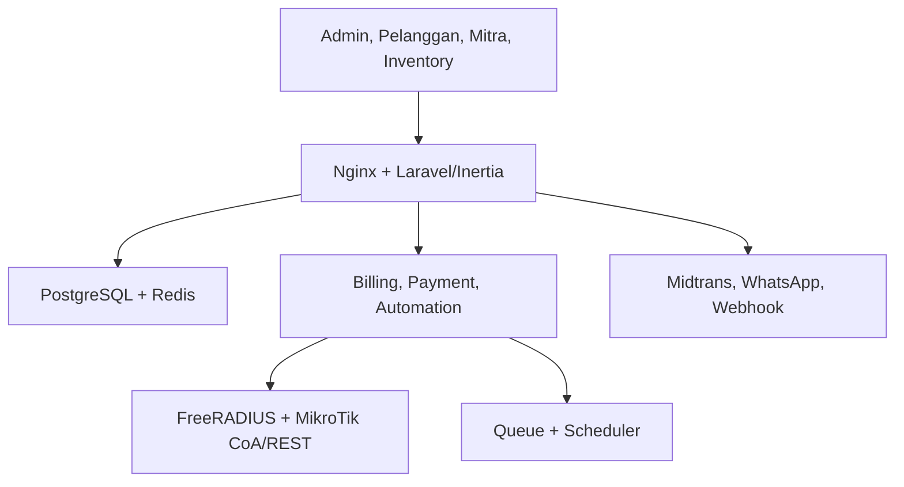

# Laporan Audit Fase 0 — Jaringanku Billing ISP

**Tanggal audit:** 21 Agustus 2026  
**Repository:** [rumahsoftware551/billingISP](https://github.com/rumahsoftware551/billingISP)  
**Branch/baseline:** `main` pada commit [`1def1979f0030a14552a800c83b78ba3324d66f8`](https://github.com/rumahsoftware551/billingISP/commit/1def1979f0030a14552a800c83b78ba3324d66f8) — “Jaringanku v1.2.0 Go-Live”  
**Mode audit:** read-only; tidak ada perubahan kode, commit, pull request, deployment, atau akses produksi  
**Sasaran:** kesiapan pilot terkontrol dan kesiapan produk komersial untuk ISP/RT-RW Net

## 1. Keputusan eksekutif

| Keputusan | Status | Alasan utama |
|---|---|---|
| Siap dipakai di produksi umum | **TIDAK SIAP** | Belum ada bukti runtime/E2E; terdapat risiko correctness pembayaran, tenant, RADIUS, inventory, backup, dan deployment. |
| Siap dijual ke banyak ISP | **TIDAK SIAP** | Selain blocker teknis, paket lisensi, privasi, SLA, dukungan, upgrade, dan matriks fitur komersial belum lengkap. |
| Siap pilot terkontrol | **BELUM** | Pilot baru layak setelah seluruh P1 ditutup, test otomatis tersedia, backup-restore terbukti, dan uji MikroTik nyata lulus. |

Tidak ditemukan **P0 terkonfirmasi** dari audit statis ini. Ditemukan **16 P1**, **11 P2**, dan **3 P3**. Nilai positifnya: fondasi produk cukup luas, pemisahan modul jelas, tenant scope telah digunakan luas, password/secret integrasi utama dienkripsi, pembayaran mengunci baris invoice, upload bukti pembayaran disimpan privat, gateway memverifikasi signature dan nominal, serta topologi Docker tidak mempublikasikan PostgreSQL/Redis ke host.

Namun, label commit “Go-Live” belum didukung release evidence yang memadai. Metadata internal juga tidak konsisten: `VERSION.txt` menyatakan `1.2.0-dev`, dan dokumen validasi repository mengakui pemeriksaan hanya statis serta belum menguji Docker penuh, PostgreSQL/Redis, FreeRADIUS, dan MikroTik nyata.

## 2. Baseline dan inventaris

| Item | Hasil |
|---|---:|
| File terlacak | 413 |
| File PHP aplikasi | 199 |
| Controller | 62 |
| Model | 75 |
| Service | 27 |
| Migration | 18 |
| Source frontend JS/TS/TSX | 44 |
| Test executable | **0** |
| Workflow CI | **0** |
| Lockfile Composer/npm | **0** |
| Route web | 157 |
| Route API | 5 |
| Route dengan permission eksplisit | 69 |
| Status worktree setelah audit | Bersih |

Stack yang teridentifikasi: PHP 8.5 pada image produksi, Laravel 13, PostgreSQL 18, Redis 8, React 19, Inertia 3, Tailwind 4, Vite 8, FreeRADIUS 3.2.10, integrasi MikroTik REST/CoA, Midtrans, WhatsApp Cloud API, webhook tenant, portal pelanggan, portal mitra, inventory, field operations, dan control-plane SaaS.

## 3. Peta arsitektur ringkas

Sumber data domain berada di tabel aplikasi per tenant. Proyeksi autentikasi/otorisasi jaringan ditulis ke tabel standar FreeRADIUS. Proses suspend/reactivate dapat mengubah proyeksi RADIUS dan mengirim CoA/Disconnect ke MikroTik. Karena itu, konsistensi transaksi database dengan efek eksternal adalah area keselamatan utama.

## 4. Temuan terprioritas

### P1 — blocker sebelum pilot

| ID | Temuan dan bukti | Dampak | Rekomendasi/acceptance test |
|---|---|---|---|
| F-001 | **Tidak ada test otomatis dan CI.** `tests/Feature` hanya berisi `.gitkeep`; `.github/workflows` tidak ada. | Regresi tenant, invoice, payment, RADIUS, dan upgrade tidak dapat dideteksi sebelum rilis. | Buat unit, feature, integration, dan E2E tenant-negatif; CI wajib menjalankan lint, static analysis, test, build, migration fresh/upgrade, dan security scan. Merge harus diblokir jika gagal. |
| F-002 | **Build tidak deterministik.** Tidak ada `composer.lock` atau lockfile npm; Dockerfile memakai dependency semver dan image tag tanpa digest. | Build hari ini dan besok dapat berbeda; CVE/license inventory tidak dapat direproduksi. | Commit lockfile, gunakan `npm ci`/`composer install --no-dev`, pin image digest, hasilkan SBOM, jalankan audit dependency dan license allowlist di CI. |
| F-003 | **Container aplikasi menjalankan migration otomatis setiap start.** [`docker/php/entrypoint.sh`](https://github.com/rumahsoftware551/billingISP/blob/1def1979f0030a14552a800c83b78ba3324d66f8/docker/php/entrypoint.sh#L65-L68) dan `RUN_MIGRATIONS=true` pada service app. | Restart/redeploy dapat mengubah schema tanpa gate, mengalami race, atau menjalankan migration destruktif sebelum backup/approval. | Pindahkan migration ke deploy job tunggal yang terkunci, memiliki pre-backup, dry-run/review, backward-compatible rollout, dan rollback/roll-forward plan. |
| F-004 | **Readiness memberi false-positive saat queue/scheduler mati.** `SystemHealthService` hanya menjadikan DB/Redis/storage sebagai syarat `ready`; heartbeat worker/scheduler hanya membuat status `degraded`. | Aplikasi dinyatakan siap (HTTP 200) walau invoice automation, notifikasi, webhook, dan settlement async tidak berjalan. | Pisahkan liveness/readiness/dependency health; readiness proses bisnis wajib gagal jika heartbeat queue/scheduler lewat ambang. Uji kill-worker dan kill-scheduler. |
| F-005 | **Backup produksi hanya PostgreSQL.** [`docker/backup/backup-loop.sh`](https://github.com/rumahsoftware551/billingISP/blob/1def1979f0030a14552a800c83b78ba3324d66f8/docker/backup/backup-loop.sh) tidak mencadangkan volume `storage`. Bukti bayar, logo, QR, dan upload berada di volume tersebut. | Restore DB tanpa file menghilangkan bukti finansial dan aset tenant; checksum backup belum membuktikan restore. | Backup terenkripsi untuk DB + storage + manifest konfigurasi; off-site copy; retention; tenant-aware export; restore drill berkala dengan RPO/RTO terukur. |
| F-006 | **Efek jaringan dapat terjadi sebelum transaksi review bukti pembayaran commit.** `ManualPaymentProofController::review()` membuka transaksi luar; `PaymentService::postToInvoice()` menjalankan transaksi bersarang lalu memanggil billing automation/CoA sebelum transaksi luar selesai. | Rollback review dapat meninggalkan service sudah aktif/disconnect telah dikirim, sementara pembayaran/bukti tidak terposting. | Gunakan after-commit outbox/saga untuk projection dan CoA. Acceptance: paksa exception setelah payment posting dan buktikan tidak ada efek eksternal sebelum commit. |
| F-007 | **Settlement gateway yang bersamaan dengan pembayaran lain dapat menghilangkan kelebihan dana.** Notification service memvalidasi gross terhadap nilai transaksi awal, tetapi memposting `min(amount, balance_due)` lalu menandai transaksi gateway paid. | Uang yang benar-benar diterima provider tidak seluruhnya masuk ledger, credit, refund, atau exception reconciliation. | Catat seluruh settlement provider ke immutable gateway ledger; alokasikan ke invoice, sisanya menjadi customer credit/refund queue. Uji cash/manual payment bersamaan dengan webhook settlement. |
| F-008 | **Pembayaran manual/admin/mitra tidak memiliki idempotency key.** `payments.reference` tidak unik; retry partial payment dapat membuat posting ganda selama saldo masih cukup. | Double charge/double posting akibat retry browser, timeout, atau operator. | Tambah idempotency key unik per tenant/source, unique provider reference, request hash, dan respons replay. Uji 20 request konkuren dengan key sama menghasilkan satu payment. |
| F-009 | **Dual-write domain–RADIUS tidak atomik dan tanpa rekonsiliasi otomatis.** Service/customer/NAS disimpan dahulu, lalu proyeksi RADIUS dijalankan terpisah; resync umumnya manual. | Customer aktif dapat gagal login, credential lama tetap aktif, atau NAS secret/proyeksi tertinggal. | Transactional outbox, idempotent projector, retry/dead-letter, checksum drift, dan reconciliation terjadwal. Uji kegagalan DB RADIUS/CoA serta recovery otomatis. |
| F-010 | **Kebijakan webhook rentan DNS rebinding/IPv6 SSRF.** URL divalidasi melalui resolusi IPv4, lalu HTTP client melakukan resolusi baru; alamat tidak dipin, AAAA tidak diperiksa. | Tenant admin dapat memaksa koneksi ke metadata/internal network melalui TOCTOU DNS atau IPv6. | Resolve A+AAAA, blok semua rentang nonpublik/special, pin IP saat koneksi sambil menjaga TLS SNI/Host, batasi redirect, dan terapkan egress firewall/proxy. |
| F-011 | **Host MikroTik menerima string arbitrer.** [`RouterController`](https://github.com/rumahsoftware551/billingISP/blob/1def1979f0030a14552a800c83b78ba3324d66f8/app/Http/Controllers/Network/RouterController.php) membentuk endpoint REST dari host/port tenant dan dapat menonaktifkan verifikasi TLS. | SSRF/port probing terhadap jaringan internal dari control-plane SaaS; credential bisa dikirim ke endpoint yang salah. | Tetapkan arsitektur konektivitas: agent/VPN per tenant atau allowlist subnet/router, DNS/IP policy, TLS wajib, egress segmentation, dan audit test. |
| F-012 | **Autentikasi webhook WhatsApp fail-open.** Signature hanya diverifikasi jika `app_secret` terisi; endpoint tetap menerima payload saat secret kosong. | Request publik palsu dapat memanipulasi status log pesan dan mengotori audit/operasi. | Endpoint harus disabled atau menolak semua request jika secret belum dikonfigurasi; verifikasi signature wajib, replay window/event dedupe, dan negative tests. |
| F-013 | **Integritas tenant tidak ditegakkan penuh di database.** Banyak tabel menyimpan `tenant_id` dan foreign ID secara terpisah tanpa composite FK tenant. Contoh: service–customer–plan–router, membership–role, billing/payment, partner, inventory. | Bug kode/data import dapat membuat relasi lintas tenant; global scope tidak melindungi query raw/relasi yang inkonsisten. | Tambahkan composite unique/FK atau tenant-key checks terpusat, RLS bila cocok, migration audit data, serta test negatif lintas tenant untuk setiap route dan service. |
| F-014 | **Implicit route binding dapat berjalan sebelum `CurrentTenant` dipasang.** Global scope `BelongsToTenant` aktif hanya saat konteks tenant sudah bound; banyak controller mengompensasi dengan guard manual, tetapi tidak ada test matriks. | Satu route baru/guard yang terlupa dapat menjadi IDOR lintas tenant. | Implement tenant-aware explicit binding/scoped bindings yang tidak bergantung urutan middleware; policy authorization wajib; test semua parameter route dengan ID tenant lain. |
| F-015 | **Penerimaan purchase order inventory rentan over-receive konkuren.** Sisa PO dihitung sebelum transaksi dan baris item tidak di-`lockForUpdate`; dua request dapat sama-sama lolos lalu mengincrement jumlah. | Stok dan nilai purchase order salah; audit inventory/COGS tidak dapat dipercaya. | Lock purchase item dan PO sebelum menghitung sisa, gunakan conditional update/check constraint, idempotency key, transaction retry. Uji dua receive paralel pada sisa yang sama. |
| F-016 | **Seeder produksi dapat menaikkan privilege akun global yang sudah ada.** `User::firstOrCreate` berdasarkan email lalu selalu memaksa `is_platform_admin=true`; deploy selalu menjalankan `db:seed --force`. | Jika email seed bertabrakan dengan user global biasa, user tersebut menjadi platform admin. | Pisahkan bootstrap platform admin dari seeder data referensi; fail jika akun sudah ada tetapi bukan identitas bootstrap; one-time signed bootstrap; audit dan MFA wajib. |

### P2 — wajib sebelum penjualan umum

| ID | Temuan | Rekomendasi |
|---|---|---|
| F-017 | `PlatformPlan.features` disimpan tetapi tidak digunakan sebagai entitlement; hanya limit customer/service/router/user yang ditegakkan. | Buat satu feature-gate server-side untuk route, job, menu, API, dan portal; uji downgrade/expired subscription. |
| F-018 | Billing belum memiliki keputusan/flow lengkap untuk proration instalasi, pajak, discount, credit balance, refund, write-off, void/cancel, dispute, dan payment reversal. | Tetapkan kebijakan akuntansi dan immutable journal; jangan hanya mengubah saldo invoice. Buat test tabel skenario dan rekonsiliasi. |
| F-019 | Rekam billing run bulanan dapat digunakan ulang dan counternya direset saat rerun. | Setiap attempt harus immutable dengan run ID baru, parent/retry relation, parameter snapshot, actor, dan hasil per invoice. |
| F-020 | Logout portal pelanggan/mitra/inventory hanya menghapus key persona dan regenerasi CSRF token, bukan menginvalidasi session; beberapa persona dapat tersisa pada session yang sama. | Pisahkan guard/cookie portal atau invalidasi total sesuai model ancaman; tambahkan test pergantian persona/tenant dan session fixation. |
| F-021 | Export laporan membangun seluruh dataset dengan `get()` dan `array_map` sebelum streaming. Export customer/service/session juga tidak selalu dibatasi rentang. | Gunakan cursor/chunked streaming atau job async ke object storage, limit, timeout, audit, dan uji dataset skala target. Formula injection CSV sudah dimitigasi. |
| F-022 | Hardening container/proxy belum lengkap: proses tidak menetapkan non-root user/capability drop/read-only filesystem/resource limit; app healthcheck hanya `php-fpm -t`; `TRUSTED_PROXIES=*`; HSTS/CSP/Permissions-Policy tidak ada pada konfigurasi yang ditinjau. | Tetapkan user non-root, read-only rootfs/tmpfs, resource limits, secret rotation, proxy CIDR nyata, security headers dan TLS policy pada reverse proxy. |
| F-023 | Sanitasi `SecurityEventService` hanya top-level; payload nested dapat menyimpan token/secret/PII. Retention dan tenant export/delete policy audit/log belum didefinisikan. | Recursive redaction, schema allowlist, retention per jenis data, access logging, privacy request workflow, dan tests dengan nested secrets. |
| F-024 | Penggantian branding/QR menghapus file lama sebelum file baru tersimpan dan record DB berhasil disimpan. File publik juga tidak termasuk backup. | Simpan baru dahulu, commit metadata, hapus lama after-commit; gunakan garbage collection dan backup aset. |
| F-025 | Portal invoice dan halaman integrasi men-serialize model transaksi gateway secara luas, termasuk token/response provider dan internal IDs. | Gunakan DTO/Resource allowlist per persona; hanya kirim status, URL pembayaran milik customer, expiry, dan nilai yang diperlukan. |
| F-026 | User anggota beberapa tenant selalu dipilihkan default/tenant aktif pertama oleh `EnsureTenant`; tidak ada tenant switch eksplisit. | Buat pemilih tenant dengan session-bound tenant ID, re-authorization setiap switch, dan audit; jangan mengandalkan urutan query. |
| F-027 | Script acceptance dapat menyatakan “passed” tanpa restore drill, browser E2E, webhook nyata, dan MikroTik nyata; dokumen repository sendiri mengakui batas ini. | Ganti nama gate statis menjadi preflight; buat evidence bundle pilot nyata dengan timestamp, versi, log tersanitasi, hasil restore, dan sign-off. |

### P3 — penyempurnaan kualitas

| ID | Temuan | Rekomendasi |
|---|---|---|
| F-028 | Banyak file TSX dipadatkan menjadi satu baris dan props memakai `any`, sehingga review, static analysis, dan perawatan mahal. | Format otomatis, ESLint/Prettier, strict TypeScript, komponen/DTO typed, batas kompleksitas. |
| F-029 | Aksesibilitas belum konsisten: beberapa gambar tanpa `alt`, label/aria tidak merata, dan belum ada bukti keyboard/screen-reader/contrast test. | Target WCAG 2.2 AA; axe/Lighthouse CI dan QA keyboard/mobile pada portal utama. |
| F-030 | Service worker portal terdaftar dari scope root walau hanya mengintersep jalur portal; error registrasi ditelan. | Batasi scope `/portal/`, versioning/cache telemetry, tampilkan fallback/update UX yang dapat dipantau. |

## 5. Sepuluh blocker komersial teratas

1. Correctness settlement dan idempotency pembayaran (F-006–F-008).
2. Isolasi dan integritas lintas tenant (F-013–F-014).
3. Konsistensi source-of-truth dengan FreeRADIUS/MikroTik (F-009).
4. Tidak adanya test otomatis dan CI release gate (F-001).
5. Build/release tidak deterministik dan tidak dapat diaudit (F-002).
6. Backup tidak mencakup file dan restore belum terbukti (F-005).
7. Migration otomatis pada restart serta readiness false-positive (F-003–F-004).
8. SSRF/egress pada webhook dan koneksi router (F-010–F-011).
9. Correctness inventory pada concurrency (F-015).
10. Paket komersial/legal belum ada: repository terlihat publik namun `composer.json` menyebut `proprietary`; tidak ditemukan LICENSE/EULA, third-party notices, privacy policy/DPA, SLA, support/EOL, atau terms of service. Ini memerlukan keputusan pemilik dan tinjauan hukum, bukan hanya perubahan kode.

## 6. Kontrol yang sudah baik

- Login admin dan ketiga portal melakukan rate limiting serta regenerasi session saat login.
- `.env.production.example` memakai `APP_DEBUG=false`, HTTPS, secure/encrypted session; script produksi memvalidasi beberapa nilai penting.
- Secret produksi dibuat acak, berpermission `0600`, dipasang melalui Docker secrets, dan file nyata tidak ditrack.
- Credential router, PPPoE source-of-truth, gateway, WhatsApp, dan webhook menggunakan enkripsi model atau ciphertext.
- `PaymentService` mengunci invoice dan menolak overpayment langsung/void.
- Upload bukti pembayaran membatasi MIME/ukuran dan disimpan pada disk privat; download diotorisasi dan `no-store`.
- Midtrans signature dan gross amount divalidasi; event hash dan lock Redis mengurangi duplicate webhook.
- Pemanggilan `radclient` menggunakan temp file `0600` dan `proc_open` array, bukan interpolasi shell.
- PostgreSQL dan Redis tidak dipublikasikan ke host; web default bind ke `127.0.0.1`; ada helper firewall RADIUS.
- Queue Redis menggunakan `after_commit=true`; webhook memakai HMAC, attempt history, dan backoff.
- Scan pola secret tidak menemukan private key, `APP_KEY` nyata, GitHub token, atau payment key umum yang tercommit. Password yang ditemukan berada pada contoh/local demo; pemisahan environment tetap wajib diuji.
- JSON (4 file), YAML (2 file), dan Bash (20 file) lulus pemeriksaan sintaks yang tersedia.

## 7. Matriks pemeriksaan

| Pemeriksaan | Status | Catatan |
|---|---|---|
| Baseline GitHub, commit, visibility, branch | **PASS** | Diverifikasi dengan konektor GitHub dan clone lokal read-only. Repository berstatus public. |
| Worktree/repository integrity | **PASS** | `main` bersih pada SHA audit; `git fsck` tidak melaporkan error. |
| JSON/YAML/Bash syntax | **PASS** | 4 JSON, 2 YAML, 20 shell Bash. |
| Secret pattern scan | **PASS terbatas** | Tidak menemukan key/token production umum; bukan pengganti secret scanner penuh/history scan. |
| PHP syntax, Composer validate/test/audit | **NOT RUN** | PHP dan Composer tidak tersedia di lingkungan audit. |
| TypeScript check dan Vite production build | **NOT RUN** | `node_modules`/lockfile tidak ada; instalasi registry paket tidak tersedia. |
| npm/Composer CVE dan license audit | **NOT RUN** | Tidak ada lockfile, sehingga versi transitif yang tepat tidak diketahui. |
| Docker Compose config/build/up/health | **NOT RUN** | Docker tidak tersedia. |
| Migration fresh dan upgrade dari versi sebelumnya | **NOT RUN** | PHP/PostgreSQL/runtime tidak tersedia; tidak ada fixture upgrade otomatis. |
| Redis queue/scheduler failure test | **NOT RUN** | Runtime tidak tersedia. |
| FreeRADIUS config/auth/accounting/CoA | **NOT RUN** | `radiusd`, PostgreSQL, dan NAS tidak tersedia. |
| MikroTik REST dan router nyata | **NOT RUN** | Tidak ada perangkat/lab; repository juga mengakui batas ini. |
| Browser E2E/responsive/accessibility | **NOT RUN** | Aplikasi tidak dapat dibangun/dijalankan di lingkungan audit. |
| Backup-restore penuh DB + storage | **FAIL desain / NOT RUN restore** | Implementasi hanya DB; restore drill tidak tersedia. |

**Prinsip penting:** `NOT RUN` tidak boleh dipromosikan menjadi `PASS` atau bukti “go-live”.

## 8. Checklist kesiapan

### Security dan tenant

- [ ] Semua route/model binding tenant-aware dan memiliki negative cross-tenant test.
- [ ] Composite tenant FK/check atau RLS menutup relasi lintas tenant.
- [ ] SSRF webhook/router ditutup dengan IP pinning dan egress policy.
- [ ] WhatsApp webhook fail-closed, replay-protected, dan idempotent.
- [ ] MFA untuk platform/system admin, recovery code, session/device management.
- [ ] Recursive log redaction, retention, privacy export/delete, audit tamper protection.
- [ ] SAST, dependency scan, secret history scan, container scan, DAST, dan pentest independen.

### Billing dan payment

- [ ] Immutable financial journal; idempotency pada semua jalur payment.
- [ ] Settlement–allocation–credit/refund selalu balance dan dapat direkonsiliasi.
- [ ] Aturan tax, proration, discount, refund, reversal, void, write-off disetujui pemilik.
- [ ] Concurrency test invoice/payment/manual proof/gateway lulus.
- [ ] Efek suspend/reactivate hanya diproses after-commit melalui outbox.

### RADIUS dan jaringan

- [ ] Idempotent projection + scheduled drift reconciliation + dead-letter UI.
- [ ] Uji auth accept/reject, accounting start/interim/stop, duplicate packet, timeout.
- [ ] Uji CoA/disconnect sukses/gagal/retry dengan MikroTik versi yang didukung.
- [ ] Kebijakan username global lintas tenant diputuskan dan didokumentasikan.
- [ ] RADIUS DB/NAS shared secret memiliki akses, rotation, dan backup policy ketat.

### Reliability, release, dan data

- [ ] Lockfile, SBOM, signed image/artifact, pinned digest, provenance.
- [ ] CI wajib, staging production-like, migration deploy job tunggal.
- [ ] Readiness gagal jika queue/scheduler/dependency bisnis gagal.
- [ ] Backup DB + storage terenkripsi, off-site, restore drill memenuhi RPO/RTO.
- [ ] Monitoring metrics/log/traces, alert routing, incident runbook, status page.
- [ ] Upgrade N-1 ke N dan rollback/roll-forward diuji dengan data representatif.

### Produk dan komersial

- [ ] Entitlement fitur sesuai plan server-side.
- [ ] Onboarding tenant, import data, trial, billing SaaS, suspend/downgrade diuji.
- [ ] EULA/license, third-party notices, privacy policy/DPA, SLA, support/EOL tersedia.
- [ ] Scope supported environment, MikroTik/RouterOS, payment provider, dan limit skala jelas.
- [ ] Dokumentasi admin/customer/partner/inventory serta materi training/support tersedia.
- [ ] WCAG 2.2 AA, browser/mobile matrix, dan usability pilot lulus.

## 9. Rencana remediasi bertahap

Definisi estimasi: **S** ≤2 hari; **M** 3–7 hari; **L** 2–4 minggu. Estimasi adalah effort engineering kasar, belum memasukkan antrean review/vendor/pentest.

| Tahap | Fokus | Paket kerja | Gate keluar |
|---|---|---|---|
| Fase 1 — Safety foundation | 2–4 minggu | F-006–F-016; idempotency/ledger/outbox; tenant binding + constraint; SSRF/WhatsApp; inventory lock; bootstrap admin aman. Mayoritas M/L. | Semua P1 correctness/security memiliki test negatif dan concurrency; tidak ada efek eksternal sebelum commit. |
| Fase 2 — Reproducible quality | 3–6 minggu | F-001–F-005; lockfile/SBOM; CI; test pyramid; migration job; readiness; backup DB+storage dan restore. L. | Fresh install, N-1 upgrade, full automated suite, build signed, restore drill, failure injection lulus. |
| Fase 3 — Controlled pilot | 2–4 minggu | Staging production-like; MikroTik nyata; Midtrans sandbox/production checklist; WhatsApp/webhook; load test; observability; operator training. M/L. | 1–3 tenant pilot, data sintetis/terkontrol, sign-off finance/NOC, incident drill, 2 siklus billing tanpa selisih. |
| Fase 4 — Commercial product | 3–6 minggu | Feature entitlement; billing policy lengkap; scalability export; UX/a11y; legal/SLA/support/EOL; installer/upgrade docs. M/L. | Checklist komersial lengkap, pentest ditutup, SLA/RPO/RTO disetujui, release candidate ditandatangani. |

Urutan implementasi yang disarankan untuk Fase 1:

1. Bekukan klaim go-live dan buat branch protection/issue register.
2. Tambahkan test harness PostgreSQL/Redis serta fixture dua tenant.
3. Perbaiki payment ledger/idempotency/concurrency dan after-commit outbox.
4. Terapkan tenant-aware binding dan constraint relasional.
5. Perbaiki projection/reconciliation RADIUS dan efek CoA.
6. Tutup SSRF/router egress serta webhook WhatsApp fail-closed.
7. Perbaiki lock PO inventory dan bootstrap platform admin.
8. Setelah semua test hijau, lanjutkan ke release engineering/backup.

## 10. Keputusan pemilik yang diperlukan

1. Model produk: satu instalasi per ISP, shared multi-tenant SaaS, atau keduanya. Ini menentukan isolasi jaringan, RLS, backup tenant, dan SLA.
2. Kebijakan finansial: PPN/pajak, proration, deposit/credit, overpayment, refund, reversal, write-off, tanggal cut-off, grace period.
3. Sumber kebenaran jaringan dan target recovery saat RADIUS/MikroTik tidak tersedia.
4. Namespace PPPoE lintas tenant: tetap global unik atau diberi realm/tenant prefix.
5. Matriks plan dan entitlement fitur yang benar-benar dijual.
6. Target skala per tenant dan total platform: customer, session, invoice, webhook, upload, dan export.
7. RPO, RTO, retention, lokasi data, privasi, serta proses permintaan data pelanggan.
8. Strategi lisensi/source visibility, harga, SLA, support hours, EOL, dan kepemilikan IP/trademark.
9. Daftar RouterOS/MikroTik, payment provider, WhatsApp mode, browser, dan platform deployment yang didukung.

## 11. Batas audit

Audit ini bersifat statis terhadap satu commit. Tidak ada database berisi data produksi, runtime PHP/Docker, perangkat MikroTik, credential provider, traffic nyata, browser E2E, load test, pentest, atau restore drill. Karena tidak ada lockfile, versi dependency transitif dan status CVE/license aktual tidak dapat dipastikan. Temuan “tidak ditemukan” bukan jaminan bebas kerentanan.

## 12. Stop gate

Fase 0 selesai pada laporan ini. Sesuai batas pekerjaan, tidak ada perbaikan kode yang dilakukan. **Jangan memulai Fase 1, deployment, atau pilot sebelum pemilik menyetujui prioritas, kebijakan finansial, model deployment, dan acceptance gate di atas.**
